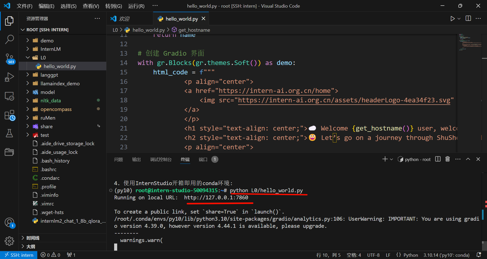
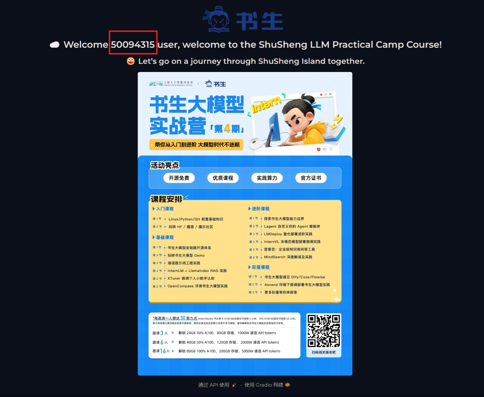
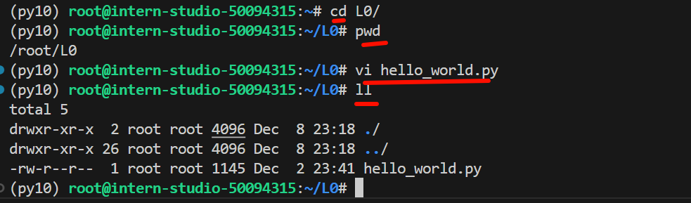
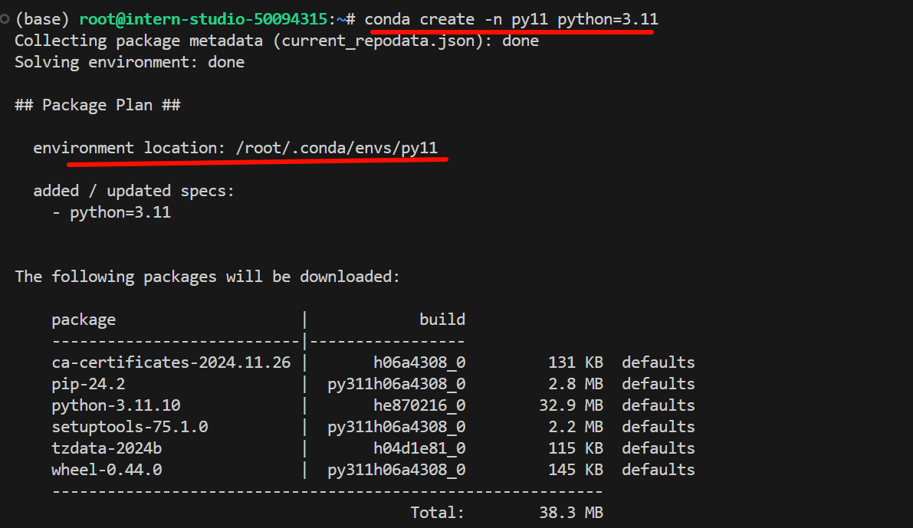
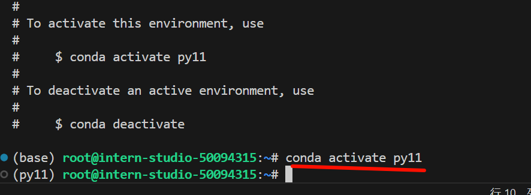

# 1_Linux前置基础

## 概览

|         | 关卡名称                | 资料                                                                                                                                                                                                       | 闯关激励   |
| :------ | :--------------------- | :--------------------------------------------------------------------------------------------------------------------------------------------------------------------------------------------------------- | :--------- |
| 第 1 关 | Linux 前置基础          | [任务](https://github.com/InternLM/Tutorial/tree/camp4/docs/L0/linux/task.md)、[文档](https://github.com/InternLM/Tutorial/tree/camp4/docs/L0/linux)、[视频](https://www.bilibili.com/video/BV13U1VYmEUr)   | 50元算力点 |
| 第 2 关 | Python 前置基础         | [任务](https://github.com/InternLM/Tutorial/tree/camp4/docs/L0/Python/task.md)、[文档](https://github.com/InternLM/Tutorial/tree/camp4/docs/L0/Python)、[视频](https://www.bilibili.com/video/BV1u61jYSExg) | 50元算力点 |
| 第 3 关 | Git 前置基础            | [任务](https://github.com/InternLM/Tutorial/tree/camp4/docs/L0/git/task.md)、[文档](https://github.com/InternLM/Tutorial/tree/camp4/docs/L0/git/)、[视频](https://www.bilibili.com/video/BV15MShYkEgg)      | 50元算力点 |
| 第 4 关 | 玩转「HF/魔搭/魔乐」平台 | [任务](https://github.com/InternLM/Tutorial/tree/camp4/docs/L0/maas/task.md)、[文档](https://github.com/InternLM/Tutorial/tree/camp4/docs/L0/maas)、[视频](https://www.bilibili.com/video/BV1XxStYYEH1/)    | 50元算力点 |

## 任务

> [task.md](https://github.com/InternLM/Tutorial/blob/camp4/docs/L0/Linux/task.md)

闯关任务需要在关键步骤中截图：

|            |                   任务描述                   | 完成所需时间 |
| ---------- | -------------------------------------------- | ------------ |
| 闯关任务   | 完成SSH连接与端口映射并运行`hello_world.py`   | 10min        |
| 可选任务 1 | 将Linux基础命令在开发机上完成一遍             | 10min        |
| 可选任务 2 | 使用 VSCODE 远程连接开发机并创建一个conda环境 | 10min        |

请将作业发布到知乎、CSDN等任一社交媒体，将作业链接提交到以下问卷，助教老师批改后将获得 50 算力点奖励！！！

提交地址：<https://aicarrier.feishu.cn/share/base/form/shrcnUqshYPt7MdtYRTRpkiOFJd>

## 文档

### 1. InternStudio开发机介绍

InternStudio 是大模型时代下的云端算力平台。基于 InternLM 组织下的诸多算法库支持，为开发者提供开箱即用的大语言模型微调环境、工具、数据集，并完美兼容 🤗 HugginFace 开源生态。

InternStduio介绍文档： [InternStudio](https://studio.intern-ai.org.cn/)

开发机有三种模式可以选择：JupyterLab、终端和VScode

### 2. SSH及端口映射

#### SSH

SSH（Secure Shell）是一种网络协议，用于在网络上的计算机之间加密数据传输。它主要用于远程登录到服务器、执行远程命令、传输文件以及管理服务器。SSH 提供了一个安全的方式来访问和控制远程系统，即使这些系统位于不安全的网络（如互联网）上。

>特性

- 加密：SSH 使用加密技术来保护数据传输，防止数据被窃听或篡改。
- 认证：SSH 支持多种认证方式，包括密码、公钥/私钥对、一次性密码等。
- 端口转发：SSH 允许端口转发，可以通过 SSH 连接将本地或远程端口转发到另一台服务器，实现安全的数据传输。
- 隧道：SSH 可以创建隧道，用于安全地传输其他协议的数据，如 HTTP、HTTPS、FTP 等。
- 压缩：SSH 可以在传输数据之前对其进行压缩，以减少带宽消耗。
- 代理连接：SSH 可以作为 SOCKS 代理，用于通过 SSH 连接转发其他网络流量。

> 用途

- 远程登录：使用 SSH 命令 ssh 用户名@服务器地址 登录到远程服务器。
- 远程执行命令：通过 SSH 连接执行远程服务器上的命令。
- 文件传输：使用 scp（Secure Copy）或 sftp（Secure File Transfer Protocol）安全地传输文件。
- 端口转发：使用 SSH 端口转发访问远程网络服务，如数据库、内部网站等。
- 隧道：创建 SSH 隧道，为其他网络流量提供加密通道。
- 集群管理：管理多个服务器和集群，自动化部署和配置。
- VPN 替代：作为 VPN 的替代方案，为网络流量提供加密。

#### 端口映射

端口映射（Port forwarding）是一种网络技术，它允许网络数据通过一个中间设备（如路由器或防火墙）从一个端口转发到另一个端口。在使用 SSH（Secure Shell）时，端口映射可以用于安全地访问内部网络中的服务器或服务，或者在远程工作时访问家庭或办公室网络中的设备。

> 本地端口转发， 远程端口转发，动态端口转发

- 本地端口转发（Local Port Forwarding）

本地端口转发将本地计算机上的一个端口转发到远程服务器上的服务。这通常用于访问远程网络上的服务，如数据库或内部网站。

`ssh -L 本地端口:目标主机:目标端口 用户名@SSH服务器`

> 示例

将本地计算机的 3307 端口映射到 SSH 服务器上的 3306 端口，然后你可以在本地计算机上使用数据库客户端连接到 localhost:3307 来访问远程的 MySQL 服务器。

```bash
ssh -L 3307:localhost:3306 用户名@SSH服务器
```

- 远程端口转发（Remote Port Forwarding）

远程端口转发将远程计算机上的一个端口转发到本地计算机上的服务。这通常用于将远程服务暴露给本地网络。

```bash
ssh -R 远程端口:目标主机:目标端口 用户名@SSH服务器
```

> 示例

将 SSH 服务器上的 80 端口映射到本地计算机的 8080 端口，然后 SSH 服务器上的其他用户可以通过连接到 SSH 服务器的 80 端口来访问你的 Web 服务。

```bash
ssh -R 80:localhost:8080 用户名@SSH服务器
```

- 动态端口转发（Dynamic Port Forwarding）

动态端口转发，也称为 SOCKS 代理，允许你通过 SSH 隧道转发任意 TCP 流量。

```bash
ssh -D 本地端口 用户名@SSH服务器
```

> 示例

将创建一个 SOCKS 代理，监听本地计算机的 1080 端口, 配置完成后，你可以在浏览器或其他应用程序中设置 SOCKS 代理为 localhost:1080，通过 SSH 隧道安全地访问互联网。

```bash
ssh -D 1080 用户名@SSH服务器
```

### 3. Linux 基础命令

1. 文件操作命令：用于文件和目录的创建、删除、复制、移动、查看等。
2. 文本处理命令：用于文本的搜索、替换、排序、比较等。
3. 磁盘管理命令：用于磁盘的分区、格式化、挂载、空间查看等。
4. 系统监控命令：用于系统性能监控、进程管理、系统信息查看等。
5. 网络管理命令：用于网络配置、网络状态查看、网络测试等。
6. 用户和权限管理命令：用于用户和组的创建、删除、权限设置等。
7. 压缩和解压缩命令：用于文件的压缩和解压缩。
8. 备份和恢复命令：用于数据的备份和恢复。
9. 包管理命令：用于软件包的安装、升级、卸载等。
10. 帮助文档命令：查看命令手册、获取帮助信息等。
11. 脚本编程命令：用于编写和执行Shell脚本。

#### 1. 文件操作命令

查看文件内容：cat, more, less, head, tail
文件复制：cp
文件移动和重命名：mv
删除文件：rm
创建文件和目录：touch, mkdir
查看文件属性：ls, stat
修改文件权限：chmod
查找文件：find

#### 2. 文本处理命令

文本搜索：grep
文本替换：sed, awk
文本排序：sort
文本比较：diff

#### 3. 磁盘管理命令

查看磁盘空间：df, du
格式化磁盘：mkfs
挂载和卸载磁盘：mount, umount

#### 4. 系统监控命令

查看系统信息：uname, hostname
查看进程信息：ps, top, htop
杀死进程：kill
系统性能监控：vmstat, iostat, mpstat
查看系统日志：dmesg, journalctl

#### 5. 网络管理命令

查看网络配置：ifconfig, ip
查看网络连接：netstat
网络测试：ping, traceroute
服务管理：systemctl, service

#### 6. 用户和权限管理命令

用户管理：useradd, usermod, userdel
用户组管理：groupadd, groupmod, groupdel
权限管理：chown, chmod

#### 7. 压缩和解压缩命令

压缩文件：tar, gzip, zip
解压缩文件：tar, gunzip, unzip

#### 8. 备份和恢复命令

备份：rsync, tar
恢复：tar

#### 9. 包管理命令

Debian/Ubuntu：apt, apt-get, dpkg
Red Hat/CentOS：yum, dnf
Arch Linux：pacman

#### 10. 帮助命令

man：显示命令的手册页。
info：提供比手册页更详细的文档。
help：显示内置shell命令的帮助信息。
apropos：搜索命令关键字。

#### 11. 脚本编程命令  

基本的脚本语言：bash, sh
函数和循环控制：if, for, while, until, case

### 4. Conda和Shell介绍

Conda 是一个开源的包管理和环境管理系统，可在 Windows、macOS 和 Linux 上运行。它快速安装、运行和更新软件包及其依赖项。使用 Conda，您可以轻松在本地计算机上创建、保存、加载和切换不同的环境。

#### 4.1 conda环境管理

> conda 默认配置文件`~/.condarc`

``` bash
# 设置清华镜像
conda config --add channels https://mirrors.tuna.tsinghua.edu.cn/anaconda/pkgs/main
conda config --add channels https://mirrors.tuna.tsinghua.edu.cn/anaconda/pkgs/free
conda config --add channels https://mirrors.tuna.tsinghua.edu.cn/anaconda/pkgs/r
conda config --add channels https://mirrors.tuna.tsinghua.edu.cn/anaconda/pkgs/pro
conda config --add channels https://mirrors.tuna.tsinghua.edu.cn/anaconda/pkgs/msys2
conda config --set show_channel_urls yes
# 创建conda环境
conda create -n name python=3.10
# 查看conda环境
conda env list
conda info -e
conda info --envs
# 激活conda环境
conda activate <name>
# 删除conda环境
conda remove --name <name> --all
# 获得环境中的所有配置
conda env export --name myenv > myenv.yml
# 重新还原环境
conda env create -f  myenv.yml
```

#### 4.2 conda和pip的一些区别：

1. conda可以管理非python包，pip只能管理python包。
2. conda可以用来创建虚拟环境，pip不能，需要依赖virtualenv之类的包。
3. conda安装的包是编译好的二进制文件，安装包文件过程中会自动安装依赖包；pip安装的包是wheel或源码，装过程中不会去支持python语言之外的依赖项。
4. conda安装的包会统一下载到当前虚拟环境对应的目录下，下载一次多次安装。pip是直接下载到对应环境中。

#### 4.3 Conda和Mamba区别

1. 基本定义与用途：
Conda：是一个开源的包管理系统和环境管理工具，用于安装、管理和切换Python包、R包、机器学习框架等。
Mamba：是一个快速包管理工具，旨在替代Conda，提供类似的功能但具有更快的安装速度和更小的体积。
2. 性能与特点：
安装速度：Mamba通常比Conda更快，因为它利用了零层包缓存。
资源占用：Mamba相对轻量级，占用更少的系统资源。
3. 兼容性与互操作性：
软件包兼容性：Conda已经存在多年，许多软件包都与Conda兼容，提供更多的选择。
互操作性：Conda和Mamba可以互操作，用户可以在两者之间轻松切换或使用它们来管理相同的Python环境，但可能需要一些调整或配置。
4. 社区支持与文档资源：
Conda拥有庞大的用户社区和丰富的文档资源，更容易找到解决方案或寻求帮助。
Mamba的社区相对较小，但正在不断发展，相关的文档和社区支持也在不断完善。

## 作业

### 闯关任务 | 完成SSH连接与端口映射并运行`hello_world.py`





### 可选任务 1 | 将Linux基础命令在开发机上完成一遍



### 可选任务 2 | 使用 VSCODE 远程连接开发机并创建一个conda环境





## FAQ

1. 如何配置 SSH 密钥对以实现免密登录？

```bash
# 生成 SSH 密钥对:
ssh-keygen -t rsa

# 将公钥复制到开发机：
ssh-copy-id 用户名@开发机IP地址

# 确保权限设置正确：
chmod 700 ~/.ssh
chmod 600 ~/.ssh/authorized_keys
```
2. 如何解决 SSH 连接超时问题？

- 可能原因：网络连接不稳定、防火墙阻止、SSH 服务未启动。
解决方法：检查网络、启动 SSH 服务、检查端口配置。

3. 如何在 Linux 中查看当前用户和所在目录？
命令：
bash
复制
whoami
pwd
4. 如何在 Linux 中查找特定文件或目录？
命令：
bash
复制
find /搜索路径 -name "文件名"
5. 如何在 Linux 中解压 .tar.gz 文件？
命令：
bash
复制
tar -zxvf 文件名.tar.gz
6. 如何在 conda 环境中安装特定版本的 Python 包？
命令：
bash
复制
conda install 包名=版本号
7. 如何解决 conda 环境创建失败的问题？
可能原因：网络问题、镜像源不可用。
解决方法：检查网络、配置镜像源、重新创建环境。
8. 如何在 VSCode 中远程连接开发机？
步骤：安装 Remote-SSH 插件、添加 SSH 主机、连接并打开文件夹。
9. 如何在 Linux 中查看系统日志？
命令：
bash
复制
journalctl -b
journalctl -xe
10. 如何在 Linux 中查看当前系统负载？
命令：
bash
复制
uptime
top

## 小结

1. 如何在 InternStudio 创建开发机

- 了解开发机及三种开发模式：JupyterLab、终端和 VSCode。
- 每个开发机都是一个 Docker 容器。

2. SSH、远程连接和端口映射

- 熟悉 SSH 命令，配置 SSH 公钥。
- 使用本地、远程和动态端口映射。
- 使用终端和 VSCode 远程连接开发机。

3. Linux 常用命令

- 文件操作、文本处理、磁盘管理、系统监控、网络管理、用户和权限管理、压缩和解压缩、备份和恢复、包管理、帮助文档、脚本编程。